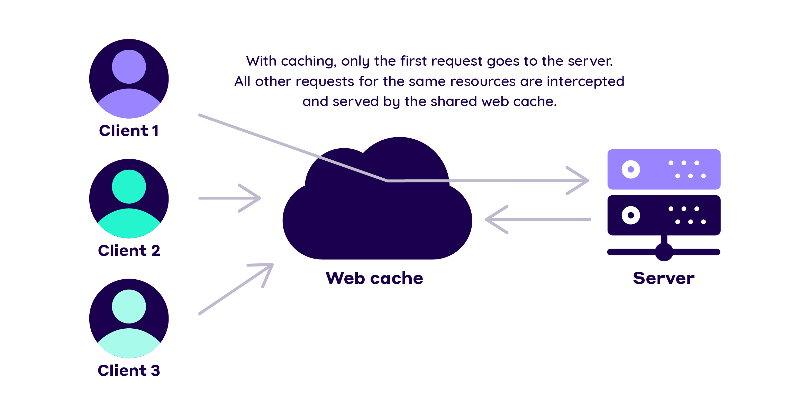

# Tận dụng Caching để tối ưu hóa hiệu suất trình duyệt

<!-- This is presenter note. You can write down notes through HTML comment. -->

---


### Mục tiêu của workshop:

Hiểu rõ về cơ chế caching trong trình duyệt và cách sử dụng nó để tối ưu hiệu suất ứng dụng web.

<style scoped>p { text-align: left; }</style>

---


### Tại sao **[Caching](https://developer.mozilla.org/en-US/docs/Web/HTTP/Caching)** quan trọng?

- Các trình duyệt thường sẽ lưu lại các bản copy của các static asset ở local để giảm thời gian tải và tối thiểu hóa lượng dữ liệu phải truyền tải, việc này gọi là caching.

- Việc caching sẽ giúp giảm thời gian tải, cùng với đó việc không tải những dữ liệu không cần thiết cũng giúp giảm lưu lượng phải truyền tải.

<!-- Cho ví dụ đời sống về caching
Ví dụ: Thư viện sách

Tình huống: Một thư viện lớn chứa hàng ngàn cuốn sách và đối với mỗi cuốn sách, thông tin như tên tác giả, thể loại, và vị trí có thể được lưu trữ trong hệ thống của thư viện.

Caching trong thực tế:

Thủ công:

Ban đầu, khi một người đọc yêu cầu thông tin về một cuốn sách cụ thể, thư viện có thể phải truy vấn cơ sở dữ liệu của mình để tìm thông tin này. Việc này có thể tốn thời gian và tài nguyên máy chủ.

Tuy nhiên, một khi thông tin về cuốn sách đã được truy vấn và hiển thị cho người đọc, thư viện có thể lưu trữ thông tin này trong bộ nhớ cache của hệ thống của mình.

Khi một người khác yêu cầu thông tin về cùng một cuốn sách, thư viện có thể truy cập thông tin này từ bộ nhớ cache thay vì phải truy vấn cơ sở dữ liệu một lần nữa, làm giảm thời gian và tài nguyên cần thiết.
Tự động:

Hệ thống thư viện có thể được cấu hình để tự động làm mới hoặc làm sạch bộ nhớ cache định kỳ để đảm bảo rằng thông tin được lưu trữ trong cache luôn là mới nhất và chính xác.

Điều này giúp tránh tình trạng thông tin lỗi thời được lưu trữ trong cache, đồng thời đảm bảo rằng việc sử dụng cache làm giảm thời gian truy cập dữ liệu một cách hiệu quả.
-->

---


### Ưu điểm của Caching

#### 1. Tính hiệu quả

- Caching giải quyết được hầu hết mọi vấn đề về hiệu năng và sự nghẽn cổ chai trong việc xử lí hàng ngàn request trong 1 thời gian.

<style scoped>h3 { text-align: center; }</style>
<style scoped>{ text-align: left; }</style>

<!--
Giả sử mỗi giây bạn nhận được 100 request, mỗi request sẽ mất 1s để chờ database query xử lý. Database sẽ dễ bị quá tải, người dùng thì chờ mòn râu.

Sử dụng caching để cache kết quả query vào RAM, lúc này thời gian tuy xuất chỉ còn tầm 50-100ms, lại không phải cần truy cập database. Hệ thống được giảm tải, còn người dùng lại nhận được kết quả nhanh hơn rất nhiều nhiều.
-->
---



---


#### 2. Đơn giản dễ hiểu, dễ implement

- Kể cả khi không dùng thư viện, chỉ cần dùng HashMap dạng Key-Value là bạn đã có thể implement caching một cách đơn giản rồi.

- Trong các hệ thống cũng vậy, khi thấy một hàm chạy lâu, tốn nhiều tài nguyên, đôi khi chỉ cần implement caching cho hàm đó là hệ thống đã chạy nhanh ngay, không ảnh hưởng đến các thành phần khác của hệ thống.

<style scoped>{ text-align: left; }</style>

<!--
Như ở trên đã nói không cần dùng thư viện thì chúng ta cũng có thể dùng LocalStorage hoặc SessionStorage dùng để làm cache mỗi khi browser của khách hàng truy cập vào website của mình
-->
---


#### 3. Support tận răng

- Do phổ biến nên hầu như các ngôn ngữ đều có những thư viện hỗ trợ caching cả.

- Trong các hệ thống lớn, người ta có những cache server riêng như **[Redis](https://redis.io)**, **[Memcache](https://memcached.org)**. Các server cache này có performance vô cùng mạnh mẽ, hỗ trợ backup v…v nên rất dễ tích hợp vào hệ thống.

<style scoped>{ text-align: left; }</style>
---


### Một số khái niệm trong Caching

1. **[Cache-Control](https://developer.mozilla.org/en-US/docs/Web/HTTP/Headers/Cache-Control)**: Hiển thị một số giá trị như max-age, no-cache, no-store,... được sử dụng để định rõ cách trình duyệt nên lưu trữ và sử dụng tài nguyên.

```
Cache-Control: max-age=3600
```

2. **[Expires](https://developer.mozilla.org/en-US/docs/Web/HTTP/Headers/Expires)**: chỉ định một thời điểm cụ thể trong tương lai khi tài nguyên sẽ hết hạn.

```
Expires: Thu, 01 Jan 2023 00:00:00 GMT
```

<!--
time tính bằng S
-->
---


3. **[LocalStorage](https://developer.mozilla.org/en-US/docs/Web/API/Window/localStorage)** và **[SessionStorage](https://developer.mozilla.org/en-US/docs/Web/API/Window/sessionStorage)**: là hai API của HTML5 được sử dụng để lưu trữ dữ liệu trên máy khách.

- Dữ liệu được lưu trong **LocalStorage** có thể tồn tại mãi mãi, trong khi dữ liệu trong **SessionStorage** chỉ tồn tại trong phiên làm việc của trình duyệt.

4. **[Service Workers](https://developer.mozilla.org/en-US/docs/Web/API/Service_Worker_API)**: là một công nghệ mạnh mẽ cho caching và xử lý sự kiện offline.

- Cho phép triển khai các chiến lược caching phức tạp và quản lý tài nguyên nằm ngoài khả năng của trình duyệt chính.

---


### Những điều cần lưu khi sử dụng Caching

#### 1. Stale Data – Stale Cache

- **Stale Data (Dữ liệu lỗi thời)**: dữ liệu trong hệ thống đã trở nên lỗi thời, tức là nó không còn đại diện cho trạng thái mới nhất của dữ liệu trong hệ thống. 

- Điều này có thể xảy ra khi dữ liệu được sao chép từ một nguồn khác nhau và không được cập nhật đồng bộ, hoặc khi dữ liệu thay đổi trong hệ thống nhưng cache không được cập nhật kịp thời.

<style scoped>h3 { text-align: center; }</style>
<style scoped>{ text-align: left; }</style>
---


- **Stale Cache (Bộ nhớ đệm lỗi thời)**: đề cập đến trạng thái của cache trong hệ thống khi nó chứa dữ liệu lỗi thời. Cache thường được sử dụng để tăng hiệu suất bằng cách lưu trữ dữ liệu mà thường xuyên được truy cập, giúp giảm thời gian truy cập dữ liệu từ nguồn gốc. 

- Tuy nhiên, khi dữ liệu được cập nhật trên nguồn gốc nhưng cache không được cập nhật kịp thời, điều này dẫn đến việc cache chứa dữ liệu lỗi thời, gọi là "stale cache".

<style scoped>{ text-align: left; }</style>

<!--
Khi làm việc với hệ thống cache, việc quản lý và xử lý "stale data" và "stale cache" là rất quan trọng để đảm bảo rằng dữ liệu được truy xuất là luôn là phiên bản mới nhất và chính xác nhất có thể.
-->
---


#### 2. Cache Invalidation (Vô hiệu hóa cache)

- Quá trình loại bỏ hoặc đánh dấu các dữ liệu trong bộ nhớ cache là lỗi thời hoặc không còn hợp lệ nữa. Quá trình này thường được thực hiện khi dữ liệu gốc đã thay đổi, do đó cần làm mới cache để đảm bảo rằng dữ liệu được truy xuất là phiên bản mới nhất.

<style scoped>{ text-align: left; }</style>
---


---


- Một số phương pháp phổ biến để thực hiện cache invalidation:

  + Thông qua giao thức HTTP với việc sử dụng các header như `Cache-Control` và `ETag`.
  + Time to Live (TTL) là một cách đơn giản để quản lý cache là thiết lập một khoảng thời gian mà dữ liệu được coi là hợp lệ trong cache sau khi nó được lưu trữ.

<style scoped>{ text-align: left; }</style>
---


### Một số HTTP Header thường gặp trong caching
---


1. **[Cache-Control Header](https://developer.mozilla.org/en-US/docs/Web/HTTP/Headers/Cache-Control)**

- **Ưu điểm**:
  - Cung cấp kiểm soát linh hoạt: Cache-Control là một header rất linh hoạt với nhiều chỉ thị như max-age, no-cache, no-store, public, private,...
  - Cho phép định rõ thời gian tối đa mà tài nguyên có thể được lưu trữ trên máy khách và các proxy server.
- **Hạn Chế**:
  - Đôi khi việc cấu hình Cache-Control có thể đòi hỏi sự cân nhắc kỹ lưỡng để đảm bảo hiểu quả và đồng thời giữ cho trang web luôn cập nhật.

---


2. **[Expires Header](https://developer.mozilla.org/en-US/docs/Web/HTTP/Headers/Expires)**

- **Ưu điểm**:

  - Xác định thời điểm cụ thể khi tài nguyên sẽ hết hạn.
  - Dễ hiểu và triển khai.

- **Hạn Chế**:

  - Thường không được ưa chuộng so với Cache-Control do thiếu sự linh hoạt.
  - Yêu cầu máy chủ đồng bộ hóa chính xác với thời gian hết hạn.

---


3. **[ETag Header](https://developer.mozilla.org/en-US/docs/Web/HTTP/Headers/ETag)**

- **Ưu điểm**:

  - Dùng để kiểm tra xem tài nguyên có thay đổi hay không.
  - Giúp máy chủ tránh việc gửi lại toàn bộ tài nguyên khi nó không thay đổi.

- **Hạn Chế**:

  - Tăng kích thước gói tin và có thể tạo ra overhead nếu không được sử dụng đúng cách.

---


4. **[Vary Header](https://developer.mozilla.org/en-US/docs/Web/HTTP/Headers/Vary)**

- **Ưu điểm**:

  - Xác định các yếu tố nào sẽ được xem xét khi kiểm tra xem tài nguyên đã được lưu trữ chưa (ví dụ: Vary: User-Agent).

- **Hạn Chế**:

  - Cần phải được sử dụng cẩn thận để tránh các vấn đề về caching không mong muốn.

---


5. **[Pragma Header](https://developer.mozilla.org/en-US/docs/Web/HTTP/Headers/Pragma)**

- **Ưu điểm**:

  - Chủ yếu được sử dụng như một phương tiện tương thích với các phiên bản HTTP cũ hơn.

- **Hạn Chế**:

  - Đã lạc lõng trong các phiên bản gần đây và thường được thay thế bằng Cache-Control.

---


### Caching trong các hệ thống thực tế

---


- Trong CPU có caching để tăng tốc độ xử lý. (Vì vậy mới có vụ lỗi bảo mật **[Meltdown](https://en.wikipedia.org/wiki/Meltdown_(security_vulnerability))**).

- SQL Server cũng có caching để lưu query plan.

- Giao thức HTTP hỗ trợ trình duyệt cache các tài nguyên từ server, thông qua **Header Cache-Control**. Nhờ header này mà web **[Thế giới di động](https://www.thegioididong.com)** load nhanh, đỡ phải tải lại resource.
---


- Bản thân **[CDN – Content Delivery Network](https://en.wikipedia.org/wiki/Content_delivery_network)** cũng là một dạng cache, đưa static resource như ảnh, CSS, JS đến server nằm gần người dùng hơn (nhằm tăng tốc độ tải).

- Trong các ứng dụng lớn, có nhiều application server, người ta thường lưu trữ cache trong một server riêng, sử dụng **[Redis](https://redis.io)** hoặc **[Memcache](https://memcached.org)**
---


### Q&A

---


### THANK YOU
